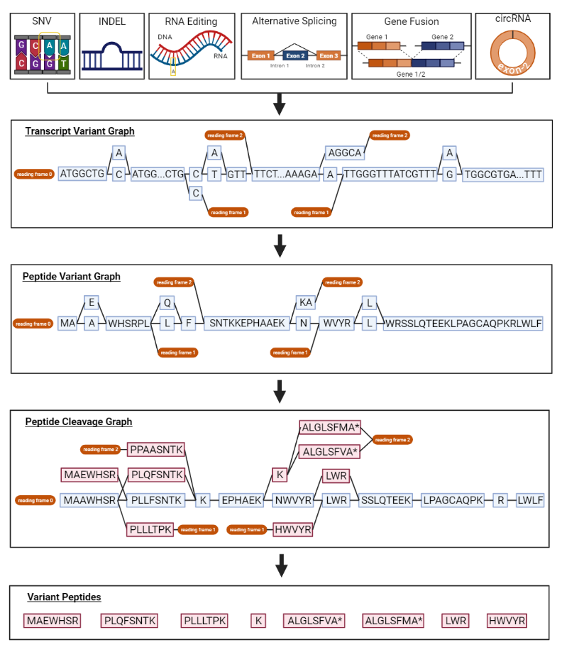

# moPepGen: <u>M</u>ulti-<u>O</u>mics <u>Pep</u>tide <u>Gen</u>erator

moPepGen (multi-omics peptide generator) uses data from one or more omics experiments and calls variant peptides as custom databases for proteogenomic library search.

moPepGen takes genomic and transcriptomic variants such as single nucleotide variants (SNPs or SNVs), small insertions/deletions (indels), gene fusion, alternative splicing, RNA circularization and RNA editing events, and generates noncanonical peptides affected by the variants.

## Installation

Install directly from GitHub

```
pip install git+ssh://git@github.com:uclahs-cds/package-moPepGen.git
```

## Overview


