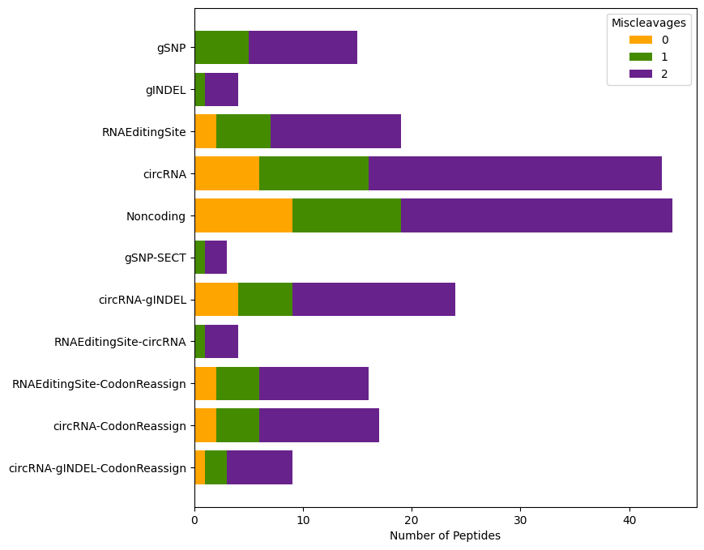

# Vignette

Welcome to the vignette for moPepGen, a powerful Python package designed for generating custom proteomic databases for library search. This vignette aims to provide you with a comprehensive overview and step-by-step guide on utilizing moPepGen to create custom databases for non-canonical peptide detection in mass spectrometry-based proteomics experiments.

## Installation

moPepGen is a command line tool designated to execute in a Unix-like environment. For MacOS and Linux users, moPepGen can be installed using the command below. For Windows users, we recommend installing and running moPepGen from WSL (Windows Subsystem for Linux).

```shell
pip install git+ssh://git@github.com/uclahs-cds/private-moPepGen.git
```

Install a specific version.

```shell
pip install git+ssh://git@github.com/uclahs-cds/private-moPepGen.git@v0.11.3
```

You can also clone the repo and install it directly from the source code.

```shell
git clone git@github.com:uclahs-cds/private-moPepGen.git
cd private-moPepGen
pip install . --use-feature=in-tree-build
```

## Reference Data

moPepGen requires a set of reference files, including the reference genome, its annotation and the translated protein sequences. We currently support reference files downloaded from two sources, ENSEMBL and GENCODE. See [here](/generate-index/#input) for more details.

A simulated reference set is provided for demonstration. The demo reference set only contains 5 transcripts and is only about 40 KB in size so should run very easily on any computer. The demo reference set can be downloaded with the commands below.

```shell
cd ~
mkdir -p moPepGen-demo
cd moPepGen-demo
wget https://github.com/uclahs-cds/private-moPepGen/raw/main/test/files/genome.fasta
wget https://github.com/uclahs-cds/private-moPepGen/raw/main/test/files/annotation.gtf
wget https://github.com/uclahs-cds/private-moPepGen/raw/main/test/files/translate.fasta
```

Convert reference set into index files for quick access by moPepGen.

```shell
moPepGen generateIndex \
    -g genome.fasta \
    -a annotation.gtf \
    -p translate.fasta \
    -o ./index
```

## Parsing

The moPepGen workflow starts with parsing a variety of variant files into GVF, a TSV format derived from VCF, to be used by moPepGen to call variant peptides.

### SNP & INDEL

Single nucleotide variants (SNVs/SNPs) and small insertions/deletions (INDELs) called by variant callers (*e.g.* GATK and Mutect2) must be annotated by the Variant Effect Predictor (VEP) first to get the genes each variant is associated with. Here is an example command with the arguments we commonly use. Please ensure that your `${OUTFILE_FILE}` ends in the suffix `.tsv` or `.txt`, as they are the formats accepted by `parseVEP`.

Note that, the VEP cache files must be downloaded prior to running VEP (see [here](https://useast.ensembl.org/info/docs/tools/vep/script/vep_cache.html)). The VEP developers recommend downloading the VEP cache version which corresponds to the Ensembl VEP installation. We also strongly recommend explicitly providing the exact reference genome and GTF file used in moPepGen to VEP to ensure the consistency of transcript IDs (i.e., using `--custom ${ANNOTATION_GTF},${REFERENCE_VERSION},gtf`). The exact genome FASTA and annotation GTF files should be used later when calling for variant peptides.

!!! warning

    If you use `--chr` to limit the chromosomes to annotate, make sure the style matches your VCF/BED file. For example, if the chromosomes have the 'chr' prefix in your VCF file (*i.e.*, chr1, chr2, ...), you must include the prefix as well (*i.e.*, `--chr chr1,chr2,chr3`).

The example data does not work for VEP.

```shell
vep \
    --offline \
    --cache \
    --check_ref \
    --no_stats \
    --fork ${N_THREADS} \
    --buffer_size 10000 \
    --distance 0 \
    --assembly GRCh38 \
    --no_intergenic \
    --chr 1,2,3,4,5,6,7,8,9,10,11,12,13,14,15,16,17,18,19.20,21,22,X,Y,M \
    -i ${INPUT_GVF_FILE} \
    -o ${OUTPUT_TSV_FILE} \
    --fasta ${GENOME_FASTA} \
    --custom ${ANNOTATION_GTF},${REFERENCE_VERSION},gtf
```

If you provided a custom GTF file to VEP, please also use a filter command to only keep the annotation records from the custom reference.

```shell
filter_vep \
    --force_overwrite \
    -i ${INPUT_FILE} \
    -o ${OUTPUT_FILE} \
    --filter "Source = ${REFERENCE_VERSION}"
```

 For demonstration, we provide the following VEP output file in TSV format, to be used by moPepGen.

```shell
wget https://github.com/uclahs-cds/private-moPepGen/raw/main/test/files/vep/vep_snp.txt
```

The output VEP TSV file must be parsed by `parseVEP` into GVF format.

```shell
moPepGen parseVEP \
    -i vep_snp.txt \
    --index-dir index \
    -o vep_snp.gvf \
    --source SNV
```

The `--source` argument is used to specify the type of variants (*e.g.*, SNP, SNV, INDEL) parsed. The source names are used in later post-processing steps, and are required by all moPepGen parsers.

### Fusion

moPepGen provides parsers to three fusion callers, [STAR-Fusion](https://github.com/STAR-Fusion/STAR-Fusion), [Arriba](https://github.com/suhrig/arriba) and [FusionCatcher](https://github.com/ndaniel/fusioncatcher).

As an example, we provide a STAR-Fusion TSV output file for demonstration.

```shell
wget https://github.com/uclahs-cds/private-moPepGen/raw/main/test/files/fusion/star_fusion.txt
```

Parse it into GVF format.

```shell
moPepGen parseSTARFusion \
    -i star_fusion.txt \
    --index-dir index \
    --source Fusion \
    -o star_fusion.gvf
```

Be default, `parseSTARFusion` only keeps fusion events with minimal `est_J` value of 5. This can be altered by the `--min-est-j` argument.

### Alternative Splicing

moPepGen accepts alternative splicing (AS) events estimated by [rMATS](https://rnaseq-mats.sourceforge.net/). RMATS estimates five AS events: SE (skipped exon), A3SS (alternative 3' splicing), A5SS (alternative 5' splicing), MXE (mutually exclusive exons), and RI (retained introns), accepted by `parseRMATS` as separate input channels. Noted that only the *.JC.txt files are supported.

Example data:

```shell
wget https://github.com/uclahs-cds/private-moPepGen/raw/main/test/files/alternative_splicing/rmats_se_case_1.SE.JC.txt
wget https://github.com/uclahs-cds/private-moPepGen/raw/main/test/files/alternative_splicing/rmats_a3ss_case_1.A3SS.JC.txt
wget https://github.com/uclahs-cds/private-moPepGen/raw/main/test/files/alternative_splicing/rmats_a5ss_case_1.A5SS.JC.txt
wget https://github.com/uclahs-cds/private-moPepGen/raw/main/test/files/alternative_splicing/rmats_mxe_case_1.MXE.JC.txt
wget https://github.com/uclahs-cds/private-moPepGen/raw/main/test/files/alternative_splicing/rmats_ri_case_1.RI.JC.txt
```

Parse AS events output by rMATS into GVF format with `parseRMATS`. Note that you don't have to provide all 5 AS files to `parseRMATS`.
By default, `parseRMATS` only accepts AS events with inclusion and exclusion junction counts of at least 1. These cutoffs can be set by `--min-ijc` and `--min-sjc`. See [here](./parse-rmats) for a complete list of arguments.

### RNA Editing Sites

RNA editing sites are specific positions within mRNA molecules where nucleotides undergo post-transcriptional modifications. moPepGen supports RNA editing sites called by [REDItools](https://github.com/BioinfoUNIBA/REDItools). Noted that the REDItools output must be annotated by the `AnnotateTable.py` from the REDItools package prior to being passed to `parseREDItools`. Below is the command that can be used to perform the annotation. Note that the `${ANNOTATION_GTF}` must be the same file later used in `parseREDItools` and `callVariant`. `${PREFIX}` is the prefix of column names for gene and transcript IDs.

```shell
AnnotateTable.py \
    -i ${INPUT_TXT} \
    -a ${ANNOTATION_GTF} \
    -s 4 \
    -c 1,2,3 \
    -n ${PREFIX} \
    -o ${OUTPUT_TXT}
```

Example data:

```shell
wget https://github.com/uclahs-cds/private-moPepGen/raw/main/test/files/reditools/reditools_annotated.txt
```

Parse REDItools output to GVF:
By default, `parseREDItools` looks for the transcript ID in column 17. This can be changed with `--transcript-id-column`, which takes a 1-based column number. See [here](./parse-reditools) for a complete list of arguments.

### CircRNA

CircRNAs are commonly recognized as noncoding RNAs, but evidence has shown that they are potentially translatable. moPepGen accepts circRNA events called by [CIRCexplorer](https://circexplorer2.readthedocs.io/en/latest/).

Download demo data:

```shell
wget https://github.com/uclahs-cds/private-moPepGen/raw/main/test/files/circRNA/CIRCexplorer_circularRNA_known.txt
```

Parse it into GVF format.

```shell
moPepGen parseCIRCexplorer \
    -i CIRCexplorer_circularRNA_known.txt \
    -o circRNA_CIRCexplorer.gvf \
    --index-dir index \
    --source CircRNA
```

By default `parseCIRCexplorer` accepts the text file output by CIRCexplorer2, however, CIRCexplorer3 is also supported with the `--circexplorer3` flag. We also provide a series of filtering parameters that can be found [here](./parse-circexplorer).

## Non-canonical Peptides Calling

moPepGen provides three commands for non-canonical peptide calling. `callVariant` for calling peptides from variant GVFs, `callNoncoding` for performing 3-frame translation on noncoding transcripts, and `callAltTranslation` for calling peptides that harbor alternative translation events such as selenocysteine termination and W > F substitutants .

### Variant Peptides

Variant peptides, peptides that harbor any variant, can be called using the `callVariant` command. `callVariant` must take one or more GVF files produced by moPepGen parsers.

```shell
moPepGen callVariant \
    -i vep_snp.gvf star_fusion.gvf alt_splice_rmats.gvf rna_editing_reditools.gvf circRNA_CIRCexplorer.gvf \
    --index-dir index \
    -o variant_peptides.fasta \
    --threads 4
```

`callVariant` supports multi-processing and the number of processors to use can be specified with the `--threads` argument. The `--selenocysteine-termination` and `--w2f-reassignment` arguments can be used to call variant peptides that also carry selenocysteine termination and W2F reassignment. By default, `callVariant` uses trypsin as the enzyme for *in silico* digestion and allows up to 2 miscleavages, and this can be specified with `--cleavage-rule` and `--miscleavage`. See [here](./call-variant) for a complete list of arguments supported by `callVariant`.

### Noncoding Peptides

Noncoding peptides, peptids that could potentially be translated from novel open reading frames in transcripts that are annotated as noncoding, can be called using `callNoncoding`. Note that `callNoncoding` does not take any variants as input but only works with the reference set of noncoding transcripts. There is no need to rerun `callNoncoding` unless you wish to use a different enzyme or reference set.

```shell
moPepGen callNoncoding \
    --index-dir index \
    -o noncoding_peptides.fasta
```

Similar to `callVariant`, trypsin is the default enzyme and the default maximum number of miscleavages is 2. These can be specified with `--cleavage-rule` and `--miscleavage`. See [here](./call-noncoding) for a complete list of arguments supported by `callNoncoding`.

### Alternative Translation Peptides

Alternative translation peptides are those that harbor special events during translation, such as selenocysteine termination and W > F substitutants, where the genetic code is not altered but a different polypeptide is produced (see [here](./call-alt-translation) for more details). Similar to noncoding peptides, `callAltTranslation` only calls peptides using reference transcripts.

```shell
moPepGen callAltTranslation \
    --index-dir index \
    -o alt_trans_peptides.fasta
```

And again, `callAltTranslation` also uses trypsin as the default enzyme, and up to 2 miscleavages by default. See [here](./call-alt-translation) for a complete list of arguments.

## Post-processing

moPepGen provides a series of post-processing commands that aim to deliver FASTA files ready for database searching. The post-processing tasks include generating summary statistics of a non-canonical database, filtering a database by transcript abundance, splitting a database to separate tiered databases, creating decoy databases, shortening fasta headers for easy handling by search engines, and merging multiple database files for multiplexed proteomic experiments.

### Summarizing

The typical first step after generating a variant peptide database is to inspect its contents. `summarizeFasta` takes a variant peptide fasta file output by `callVariant` and summarizes the variant peptides by categories based on the value of `--source` you input when calling the parser commands. `summarizeFasta` must take all GVFs used as input to `callVariant`.

```shell
moPepGen summarizeFasta \
    --gvf vep_snp.gvf star_fusion.gvf alt_splice_rmats.gvf rna_editing_reditools.gvf circRNA_CIRCexplorer.gvf \
    --variant-peptides variant_peptides.fasta \
    --index-dir index
```

By default, `summarizeFasta` outputs to stdout, which can be saved to a text file using the `-o` argument. In case `--output-image` is given, a horizontal bar plot will be saved.



Because moPepGen calls enzymatically cleaved peptides, there is the possibility that the same peptide is called from multiple transcripts, or the same transcript with different or different combinations of variants. For example, the peptide below is called twice from two separate transcripts with two different variants.

```
>ENST00000622235.5|SNV-100-G-T|4 ENST00000614167.2|RES-202-G-A|2
HETLFLLTFPR
```

To resolve the issue of collapsed peptides like the example above, we use the `--order-source` argument that takes the priority order of sources considered. It takes the source names in a comma-separated format. For example `--order-source gSNP,RNAEditing` will prioritize gSNP over RNA editing events, thus the example peptide above will be assigned to the gSNP category. Note that the values passed into `--order-source` must match the values used in `--source` in the corresponding parser calls. If `--order-source` is not provided, the source priority order will be inferred from the order of input GVF files.

Besides variant peptides called by `callVariant`, noncoding peptides and alternative translation peptides can also be passed to `summarizeFasta` with `--noncoding-peptides` and `--alt-translation-peptides`.

### Filtering

The `fitlerFasta` module is designed to take an RNA abundance matrix and filter the non-canonical peptides based on the abundances of their corresponding transcripts.

We provide an example RSEM table for demonstration.

```shell
wget https://github.com/uclahs-cds/private-moPepGen/raw/main/test/files/rsem/rsem.txt
```

```shell
moPepGen filterFasta \
    -i variant_peptides.fasta \
    -o variant_peptides_filtered.fasta \
    --exprs-table rsem.txt \
    --skip-lines 1 \
    --tx-id-col 1 \
    --quant-col 6 \
    --quant-cutoff 10 \
    --index ./index
```

`--skip-lines` indicates the top x number of lines in the abundance matrix that should be skipped. These lines are usually headers or notes output by the quantitation software. `--tx-id-col` is used to specify the 1-based column number for transcript IDs. Any type of quantitation metrics can be used for filtering (*e.g.* count, TPM, FPKM) as long as a desired cutoff is given in `--quant-cutoff` (inclusive). Note that the same reference GTF should be used during quantitation so the transcript IDs can be mapped correctly to variant peptides called by moPepGen.

### Splitting

The `splitFasta` command is provided to split a variant peptide database into several separate databases for tiered database searching, particularly for the purpose of database-specific false discovery rate control.

```shell
mkdir -p split
moPepGen splitFasta \
    --variant-peptides variant_peptides.fasta \
    --gvf vep_snp.gvf star_fusion.gvf alt_splice_rmats.gvf rna_editing_reditools.gvf circRNA_CIRCexplorer.gvf \
    --output-prefix split/split \
    --index-dir index
```

Similar to `summarizeFasta`, `splitFasta` also takes a `--order-source` to specify the priority order of which category a peptide should be assigned to, and will be inferred from the input GVFs if not specified. `--group-source` is used to group sources as a super category. For example, `--group-source Germline:gSNP,gINDEL Somatic:sSNV,sINDEL` will group sources of `gSNP` and `gINDEL` together as `Germline`, and `sSNV` and `sINDEL` as `Somatic`.

Note that, when assigning a peptide to a source category, it must carry exclusively the desired type(s) of variants. For example, a peptide of 'ENST00000622235.5|SNV-100-G-T|SNV-110-C-A|2' is assigned to `SNV`, while a peptide of 'ENST00000622235.5|SNV-100-G-T|RES-110-C-A|2' will be assigned to the category of `SNV-RNAEditing` but not `SNV`. `--max-source-groups` is used to specify the maximum number of source groups that should be split into individual FASTA files. The default value is 1, which means all peptides that contain two or more types of variants will not be written into their own FASTA file, but kept in the '\<prefix\>_Remaining.fasta' file.

Similar to `summarizeFasta`, noncoding and alternative translation peptides can be passed to `splitFasta` via `--noncoding-peptides` and `--alt-translation-peptides`.

See [here](./split-fasta) for a complete list of arguments.

### Target-Decoy Database

Most search engines expect a target-decoy database as input to estimate the false discovery rate (FDR). We provide a `decoyFasta` command, that takes a variant peptide database and adds decoy sequences with either the `reverse` or `shuffle` algorithm.

```shell
moPepGen decoyFasta \
    -i split/split_gSNP_encode.fasta \
    -o split/split_gSNP_decoy.fasta \
    --method reverse
```

By default, amino acid residues at cleavage sites are unmodified. Trypsin is the default enzyme and can be changed using `--enzyme`.  `--non-shuffle-pattern` can be used to specify additional amino acid residues to be fixed in the decoy sequence. By default, the N- and C-terminal residues are also fixed, which can be turned off by setting `--keep-peptide-nterm` or `--keep-peptide-cterm` to `false`. See [here](./decoy-fasta) for a complete list of arguments.

### Shortening FASTA headers

Some search engines have limits on how long the database FASTA headers can be. The headers of moPepGen's variant FASTA files could be very long, because the same peptide can be called from different transcripts. We provide a shortening approach by replacing all FASTA headers with UUIDs and storing the mapping information in a `.dict` file with the same prefix.

```shell
moPepGen encodeFasta \
    -i split/split_gSNP.fasta \
    -o split/split_gSNP_encode.fasta
```

Note that for decoy peptides, the same UUID as in their target sequences will be used, with the decoy prefix/suffix retained. The resulting `.dict` file can be used for mapping both back to the original FASTA header.
